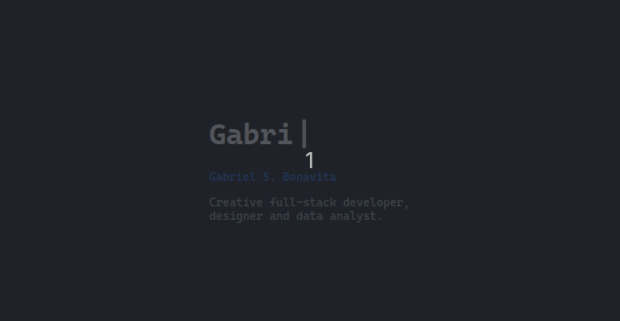

# Portfólio
Esse é um portfólio tematico de programação, com os nomes das paginas como metodos de uma Classe. 
## Funcionalidades:
- Animação de escrever, apagar e escrever de novo
- Responsividade
- Div com scroll lateral
- Multi-page
- Navegação superior
## Tecnologias
- Media query (CSS)
- Flexbox (CSS)
- Modularização (JS)
- HTML e CSS
- JavaScript

